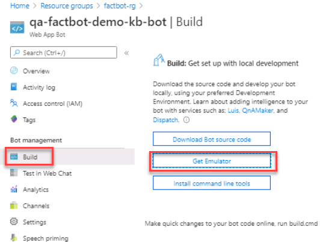
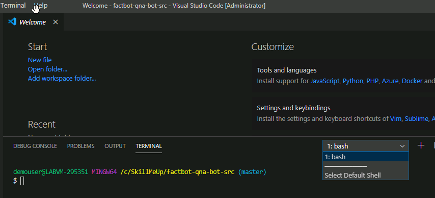
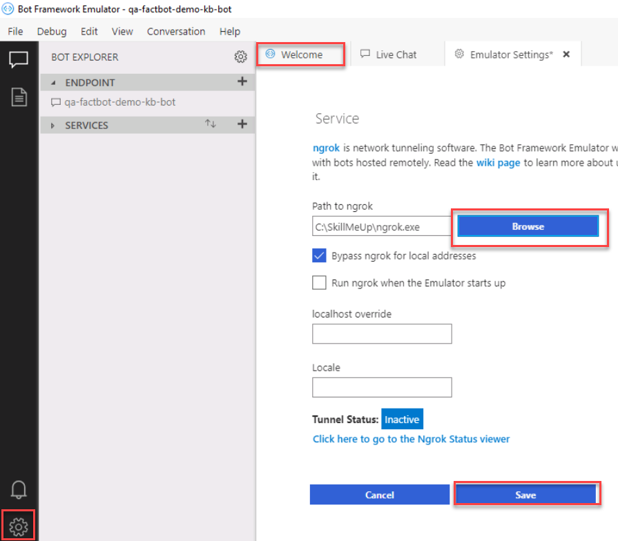
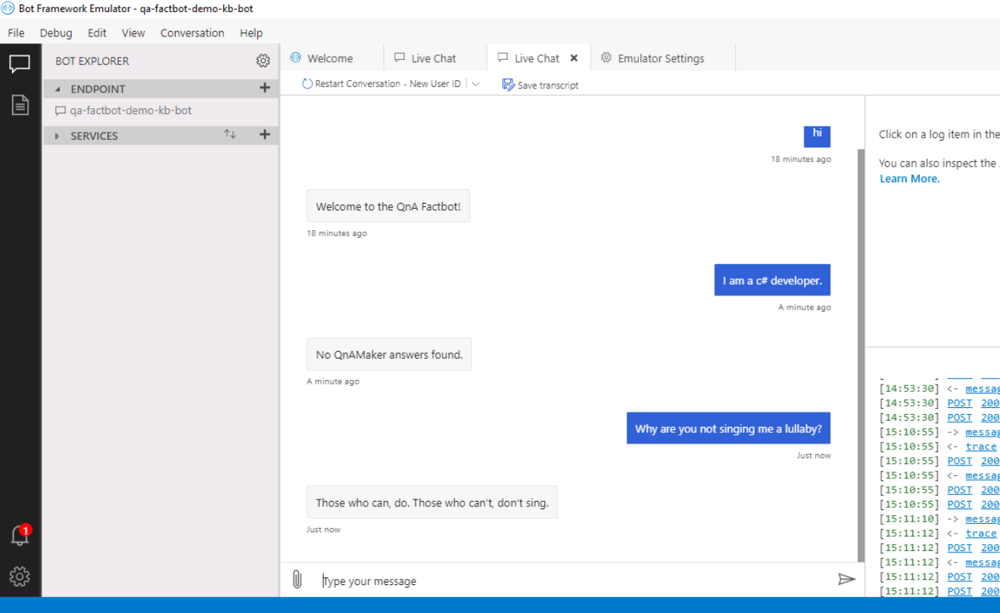

## Exercise 4: Debug the bot locally

As with any application code that you write, changes to bot code need to be tested and debugged locally before being deployed to production. To help debug bots, Microsoft offers the Bot Framework Emulator. In this exercise, you will learn how to use Visual Studio Code and the emulator to debug your bots.

1. Install the Microsoft Bot Framework Emulator by first opening your Bot in the Azure portal. Click **Build** then click **Get Emulator**. In the resulting GitHub repository, look for the latest version of the **windows-setup.exe** file. Download and install it using the default settings. After the install is complete leave the app running.

    

2. In order to run the programs, you need to restore the node packages.  

    In Visual Studio Code, open a new terminal.  

    If the terminal opens with Bash, use the dropdown to select the default shell.    

      

    When the default window opens, select `Powershell`.  Then open a new terminal.  

    

    With the powershell terminal open, run the command `npm install` to install all the missing node_modules.  

    ```  
    npm install
    ```  

    

    Once the node packages are installed, you can continue to the next step.  

3. Click **Run** > **Start debugging** to start a debugging session. Click **Node.js** when prompted. 

      

    Confirm that **restify listening to http://[::]:3978** appears in the debug console.  

      


3. Navigate to your bot in the Azure Portal and click **Configuration** under **App Service Settings** on the left.  On the **MicrosoftAppId** and **MicrosoftAppPassword** settings, click **Edit** on each setting and copy the respective values to Notepad for the next step.

    

4. Navigate to the following url in a new browser tab. Download the Windows version from the website. Open the zip file and extract the contents to **C:\\SkillMeUp**. 

    ```
    ngrok.com/download
    ```

5. Your bot code is now running locally in the node.js terminal. 

    Return to the Bot Framework Emulator window.  **Do not** click on `Open Bot`.  
    
    Instead, Click the **Settings** icon on the bottom left. Click **Browse** next to **Path to ngrok** and in the dialog that appears. navigate to **C:\\SkillMeUp** and select the ngrok executable file that was downloaded and extracted in the previous step. Click **Save** then click the **Welcome** tab at the top. 

      

6. Click **Create a new bot configuration**. 

    In the **New bot configuration** dialog, enter the following configuration, then click **Save and connect** to save the configuration file to **C:\\SkillMeUp**. 

    - Bot name: **The name of the bot (If necessary, you can find it in the Azure portal)**

    - Bot url: **http://localhost:3978/api/messages**  

        ```  
        http://localhost:3978/api/messages
        ```  

    - MicrosoftAppId: **The value you copied earlier**

    - MicrosoftAppPassword: **The value you copied earlier**
   
    > **Note:** In the future, you can reconnect to the bot simply by clicking the bot name under "My Bots."

7. Enter "hi" into the box at the bottom of the emulator and press **Enter**. 

    ```  
    hi
    ```  

    Next, enter **I am a c# developer.** 
    
    ```  
    I am a C# developer.
    ```  

    Once the bot has responded, ask the bot **Why are you not singing me a lullaby?**  

    ```  
    Why are you not singing me a lullaby?
    ```  

    

8. When you're done, return to Visual Studio code and click **Run** > **Stop debugging**. 

At this point, you have a fully functioning bot and know how to debug it by running it locally in the Microsoft Bot Emulator. The next step is to make the bot more intelligent by connecting it to the knowledge base you published in exercise 1.  

## Progressing to the next exercise  
  
After you have completed the challenge, click **Next** to move to the next exercise.  