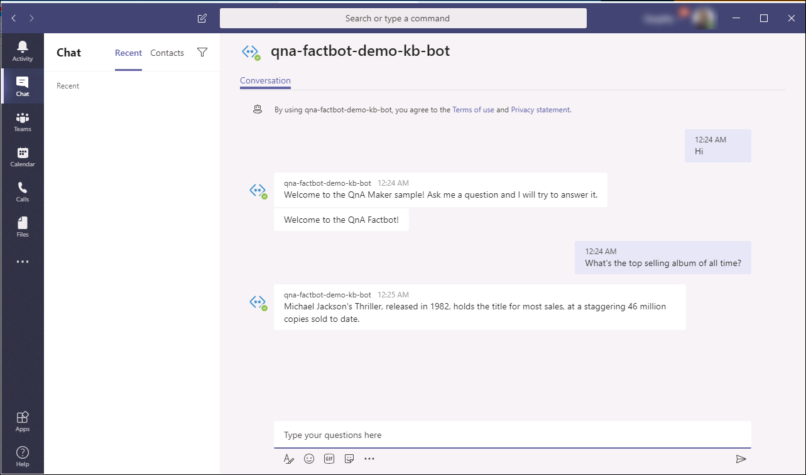

## Exercise 5: Test the bot with Teams

Once deployed, bots can be connected to channels such as Slack, Microsoft Teams, and Facebook Messenger, where you can interact with them the way you would with a person. In this exercise, you will add the bot to your Teams chat and carry on a conversation with it in Teams.

1. You can open the Teams web app with the following url. Use your own email to start a free trial or sign into an existing account. 
   
    ```html
    http://teams.microsoft.com/
    ```

2. Return to your Web App Bot in the Azure Portal and click **Channels** under **Bot management** on the left. Click the **Teams** icon. Then click **Save** at the bottom of the blade. Agree to the terms of service if prompted. 

    

3. Navigate somewhere else on the blade then return to **Channels**. Click **Microsoft Teams** and select the option to use the web app to add the bot to Teams and launch the Teams web app again.

    

4. Start a conversation with the bot by entering **hi** into the Teams window. Then converse with the bot by asking it questions and seeing how it responds. Refer to the **Factbot.tsv** file located in **C:\\SkillMeUp** for examples of questions to ask.

    

You now have a fully functional bot created with the Azure Bot Service, infused with intelligence by Microsoft QnA Maker, and available for anyone in the world to interact with. Feel free to plug your bot into other channels and test it in different scenarios. And if you would like to make the bot smarter, consider expanding the knowledge base with additional questions and answers. For example, you could use the online FAQ for the Bot Framework to train the bot to answer questions about the framework itself.  

## Ending the Lab  
  
After you have completed the exercise, click **End Lab** to complete the lab.    