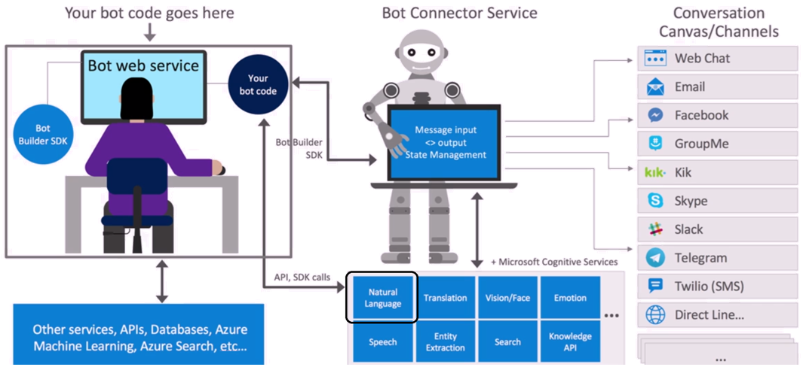
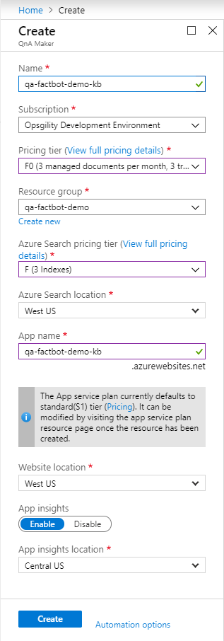
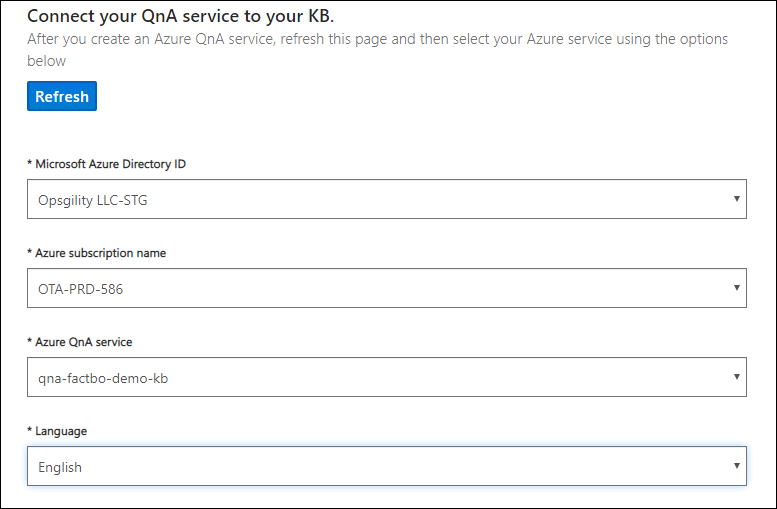
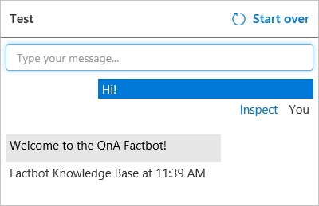

<style>
figcaption{
    display: none !important;
}
</style>

# Lab Guide

# Building a Chat Bot with the Azure Bot Service

+-----------------------------------------------------------------------+
| Conditions and Terms of Use                                           |
+=======================================================================+
| The MIT License (MIT)                                                 |
|                                                                       |
| Copyright (c) 2018 Microsoft Corporation. All rights reserved.        |
|                                                                       |
| Permission is hereby granted, free of charge, to any person obtaining |
| a copy of this software and associated documentation files (the       |
| \"Software\"), to deal in the Software without restriction, including |
| without limitation the rights to use, copy, modify, merge, publish,   |
| distribute, sublicense, and/or sell copies of the Software, and to    |
| permit persons to whom the Software is furnished to do so, subject to |
| the following conditions:                                             |
|                                                                       |
| The above copyright notice and this permission notice shall be        |
| included in all copies or substantial portions of the Software.       |
|                                                                       |
| THE SOFTWARE IS PROVIDED \"AS IS\", WITHOUT WARRANTY OF ANY KIND,     |
| EXPRESS OR IMPLIED, INCLUDING BUT NOT LIMITED TO THE WARRANTIES OF    |
| MERCHANTABILITY, FITNESS FOR A PARTICULAR PURPOSE AND                 |
| NONINFRINGEMENT. IN NO EVENT SHALL THE AUTHORS OR COPYRIGHT HOLDERS   |
| BE LIABLE FOR ANY CLAIM, DAMAGES OR OTHER LIABILITY, WHETHER IN AN    |
| ACTION OF CONTRACT, TORT OR OTHERWISE, ARISING FROM, OUT OF OR IN     |
| CONNECTION WITH THE SOFTWARE OR THE USE OR OTHER DEALINGS IN THE      |
| SOFTWARE.                                                             |
+-----------------------------------------------------------------------+

## Overview

Software bots are everywhere. You probably interact with them every day without realizing it. Bots, especially chat and messenger bots, are changing the way we interact with businesses, communities, and even each other. Thanks to light-speed advances in artificial intelligence (AI) and the ready availability of AI services, bots are not only becoming more advanced and personalized, but also more accessible to developers.

Regardless of the target language or platform, developers building bots face a variety of challenges. In order to be fully capable and useful:

- Bots must be able process input and output intelligently
- Bots need to be responsive, scalable, and extensible
- Bots need to work cross-platform
- Bots need to interact with users in a conversational manner, ideally in the language that the user chooses

The Azure Bot Service, combined with [Microsoft QnA Maker](https://www.qnamaker.ai/), provides the tools developers need to build and publish intelligent bots which interact naturally with users using a range of services. In this lab, you will create a bot using the Azure Bot Service and connect it to a knowledge base built with QnA Maker. Then you will interact with the bot using Skype — one of many popular services with which bots built with the Azure Bot Service can integrate.



### Objectives

In this hands-on lab, you will learn how to:

- Create a knowledge base, populate it with data, and connect it to a bot
- Create an Azure Web App Bot to host a bot
- Implement bots in code and debug the bots that you build
- Publish bots and use continuous integration to keep them up to date
- Debug bots locally using Visual Studio Code and the Microsoft Bot Framework Emulator
- Plug a bot into Teams and interact with it there

## Accessing Microsoft Azure

Launch a browser from the virtual machine desktop and navigate to the URL below. Your Azure Credentials are available by clicking the Cloud Icon at the top of the Lab Player.

```html
    https://portal.azure.com
```

## Exercise 1: Create a knowledge base with Microsoft QnA Maker

Microsoft QnA Maker is part of Azure Cognitive Services, which is a suite of services and APIs for building intelligent apps backed by AI and machine learning. Rather than code a bot to anticipate every question a user might ask and provide a response, you can connect it to a knowledge base of questions and answers created with QnA Maker. A common usage scenario is to create a knowledge base from a FAQ so the bot can answer domain-specific questions such as "How do I find my Windows product key" or "Where can I download Visual Studio Code?"

In this exercise, you will use QnA Maker to create a knowledge base containing questions such as "What NFL teams have won the most Super Bowls" and "What is the largest city in the world?" Then you will deploy the knowledge base in an Azure Web app so it can be accessed via an HTTPS endpoint.

1. From within the Azure portal, click **+ Create a resource**, search for **QnA Maker** and then click **Create**.


2. Enter a name such as "qa-factbot-kb" into the **Name** box. This name must be unique within Azure, so make sure a green check mark appears next to it *and* in the **App name** box further down the blade. Choose **Create New** and enter "qa-factbot-kb". Select **F0** and **F** as the pricing tiers. (Both are free tiers that are ideal for experimenting with bots.) Select the location nearest you in both location drop-downs, create a resource group called **factbot-rg**, and then click the **Create** button at the bottom of the blade.

    > Note: If you see a message about the Microsoft.Search resource provider not being registered wait 3-4 minutes and try again. It will automatically register, but the call will not succeed until registration is completed.

    

3. After the resources are created in the Azure Portal, open the Microsoft QnA Maker portal in a second tab in your browser and click the **Sign in** button (you will have to minimize the lab guide). Then click **Create a knowledge base** in the menu bar at the top of the page.

    ```html
    https://www.qnamaker.ai/
    ```

    


4. Scroll down to **Connect your QnA service to your KB** and select your **Microsoft Azure Directory ID**, **Azure subscription name**, **Azure QnA Service**, and **Language** from the drop downs.

    

    > Note: if you do not see anything in the **Azure QnA Service** dropdown the resources are not deployed completely. Wait several minutes and click **Refresh** again.

5. Name the KB **Factbot Knowledge Base**.

    ```html
    Factbot Knowledge Base
    ```

6. On **Step 4**, click the **+ Add File** button and browse to **C:\\OpsgilityTraining** and select the **Factbot.tsv** file.

7. Set **Chit-chat** to **Witty**.

8.  On **Step 5** click **Create your KB**.

9.  In the Azure Portal, click **Resource groups** in the ribbon on the left side of the portal and open the "factbot-rg" resource group. Wait until "Deploying" changes to "Succeeded" at the top of the blade indicating that the QnA service and the resources associated with it were successfully deployed. Once more, you can click **Refresh** at the top of the blade to refresh the deployment status.

    

10. In the QnA Maker portal, click **My Knowledge Bases** and then click the **Factbot Knowledge base**.

11. After the KB is open, click **Save and train** and wait for training to complete.

    

12. Click the **Test** button to the right of the **Save and train** button. Type "Hi" into the message box and press **Enter**. Confirm that the response is "Welcome to the QnA Factbot," as shown below.

    

13. Type "What book has sold the most copies?" into the message box and press **Enter**. What is the response?

14. Click the **Test** button again to collapse the Test panel. Then click **Publish** in the menu at the top of the page, and click the **Publish** button at the bottom of the page to publish the knowledge base. *Publishing* makes the knowledge base available at an HTTPS endpoint.

    

Wait for the publication process to complete and confirm that you are told the QnA service has been deployed. With the knowledge base now hosted in an Azure Web App of its own, the next step is to deploy a bot that can use it.  Do not close this window, because you will use this website to launch the bot creation process.