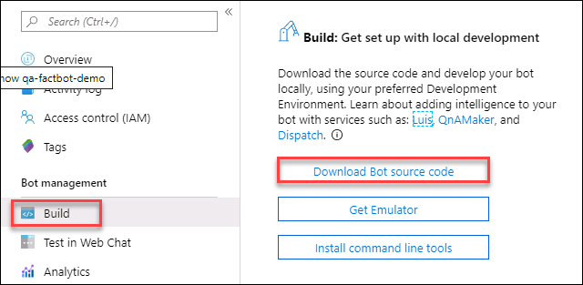

<style>
figcaption{
    display: none !important;
}
</style>

## Exercise 3: Deploy a bot with Visual Studio Code

When you created an Azure Web App Bot in Exercise 2, an Azure Web App was deployed to host it. But the bot does require some code, and it still needs to be deployed to the Azure Web app. Fortunately, the code was generated for you by the Azure Bot Service. In this exercise, you will use Visual Studio Code to place the code in a local Git repository and publish the bot to Azure by pushing changes from the local repository to a remote repository connected to the Azure Web App that hosts the bot — a process known as continuous integration.

1. Go to and install the latest LTS version of Node.js

    ```html
    https://nodejs.org/
    ```

2. Create a folder named "Factbot" in the location of your choice on your hard disk to hold the bot's source code.

3. Return to the Azure Portal and open the "factbot-rg" resource group. Then click the Web App Bot you created in Exercise 1.

    

4. Click **Build** in the menu on the left, and then click **Download bot source code** to prepare a zip file containing the bot's source code. Once the zip file is prepared, click the **Download zip file** button to download it. When the download is complete, copy the contents of the zip file to the "Factbot" folder that you created in Step 4.

    

5. Still on the "Build" blade, click **Publish Updates Automatically to Azure with Continuous Deployment**. Then select **Local Git Repository** as the deployment source and click **Continue**. From there select **App Service Build Service** and click **Continue** and then **Finish**.

6. Copy the **Git Clone Url** value and paste it into notepad.

7. Click **Deployment Credentials**, and then go to **App Credentials**.

8. Copy the user name and password to notepad. These will be used for connecting to the Git repository for your bot.

9.  Launch **git bash** on your lab VM and execute the following commands to partially configure Git to use the credentials copied.

    ```bash
    git config --global user.email [paste in Git user name]
    git config --global user.name [paste in Git user name]
    ```

10. Start Visual Studio Code and use the **File** > **Open Folder...** command to open the "Factbot" folder that you copied the bots source code earlier.

11. Click the **Source Control** button in the activity bar on the left side of Visual Studio Code and then click the **+** button. Choose the Factbot directory.

12. Type "First commit." into the message box, and then click the check mark to commit your changes. Confirm when prompted.

    

13. Select **Terminal** from Visual Studio Code's **View** menu to open an integrated terminal. Then execute the following command in the integrated terminal, replacing [GIT-USER-NAME] and [GET-CLONE-URL] with the values copied to notepad earlier and **https** removed from the git clone url.

    ```bash
    git remote add qna-factbot https://[GIT-USER-NAME]@[GIT-CLONE-URL]
    ```

14. Click the ellipsis (the three dots) at the top of the SOURCE CONTROL panel and select **Publish Branch** from the menu to push the bot code from the local repository to Azure. If prompted for credentials, enter the user name and password you specified in Step 9 of this exercise.

Your bot has been published to Azure. But before you test it there, let's run it locally and learn how to debug it in Visual Studio Code.
