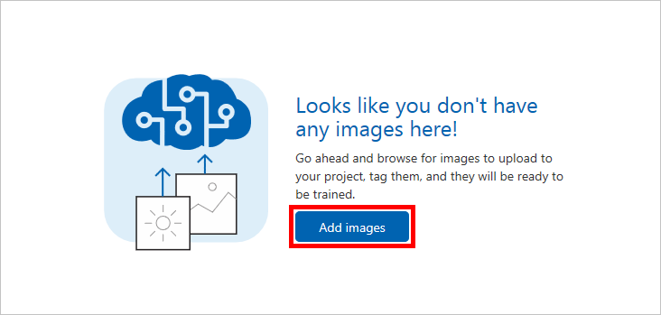
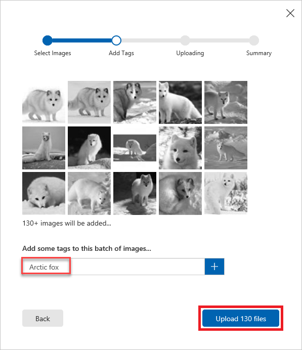
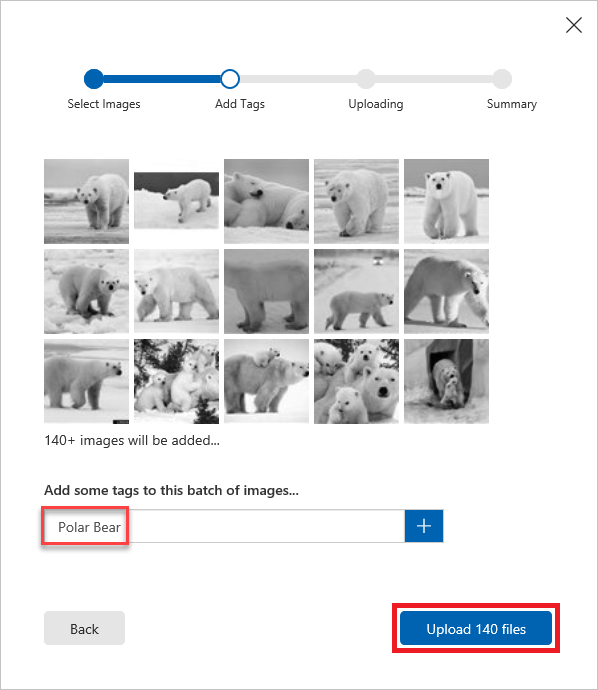
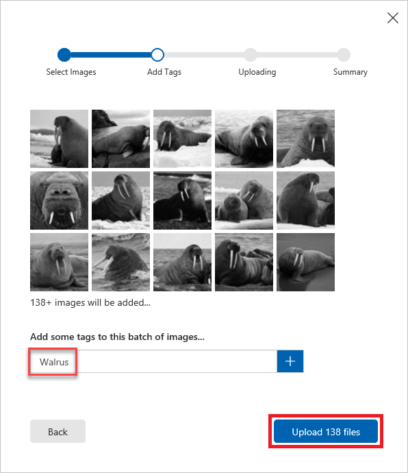
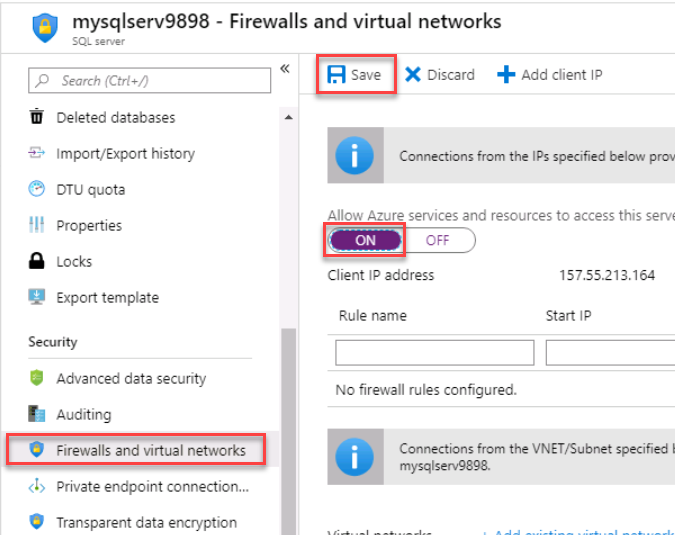
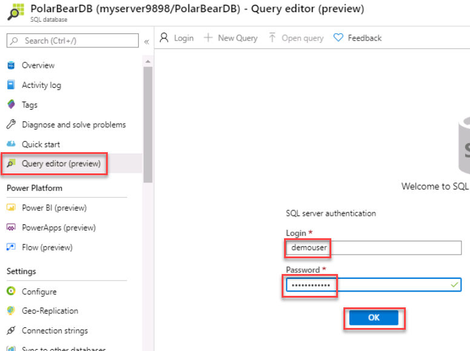
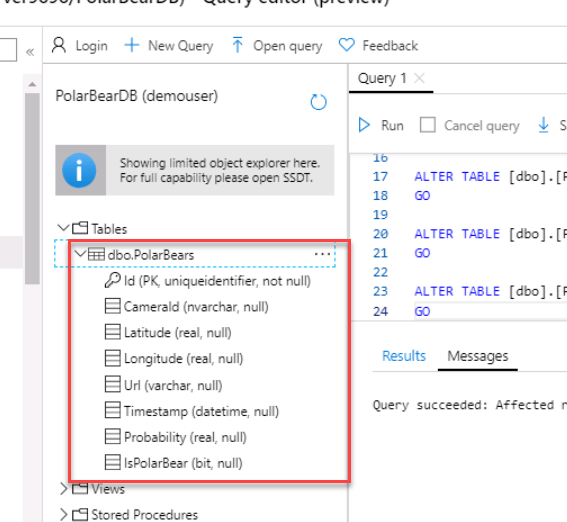
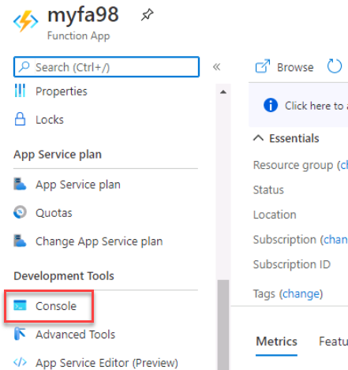

## Exercise 4: Predicting Results with Cognitive Services

[Microsoft Cognitive Services](https://azure.microsoft.com/en-us/services/cognitive-services/ "Microsoft Cognitive Services") is a suite of services and APIs backed by machine learning that enables developers to incorporate intelligent features such as facial recognition in photos and videos, sentiment analysis in text, and language understanding into their applications. Microsoft's [Custom Vision Service](https://azure.microsoft.com/services/cognitive-services/custom-vision-service/) is among the newest members of the Cognitive Services suite. Its purpose is to create image-classification models that "learn" from labeled images you provide. Want to know if a photo contains a picture of a flower? Train the Custom Vision Service with a collection of flower images, and it can tell you whether the next image includes a flower — or even what type of flower it is.

The Custom Vision Service exposes two APIs: the [Custom Vision Training API](https://southcentralus.dev.cognitive.microsoft.com/docs/services/d9a10a4a5f8549599f1ecafc435119fa/operations/58d5835bc8cb231380095be3) and the [Custom Vision Prediction API](https://southcentralus.dev.cognitive.microsoft.com/docs/services/eb68250e4e954d9bae0c2650db79c653/operations/58acd3c1ef062f0344a42814). You can build, train, and test image-classification models using the [Custom Vision Service portal](https://www.customvision.ai/), or you can build, train, and test them using the Custom Vision Training API. Once a model is trained, you can use the Custom Vision Prediction API to build apps that utilize it. Both are REST APIs that can be called from a variety of programming languages.

In this exercise, you will create a Custom Vision Service model and train it to differentiate between various types of Arctic wildlife. Then you will connect it to the Stream Analytics job you created in the previous lab.


### Objectives ###

In this exercise, you will learn how to:

- Use the Custom Vision Service to train an image-classification model

- Test a Custom Vision Service model

- Call the model from an app or service

### Time Estimate

- 40 minutes

## Task 1: Build a Custom Vision Service model

In this task, you will create a new Custom Vision Service project. Then you will upload images of polar bears, arctic foxes, and walruses and tag the images so the Custom Vision Service can learn to differentiate between them.

1. Open the **Custom Vision Service portal** in a new browser tab by navigating to the below URL. Then click **Sign In**. Agree to the terms of service and sign in with the credentials in the cloud icon if prompted. 

	```
	https://www.customvision.ai
	```

    

2. Click **New Project** then in the the dialog that appears, enter **ProjectPolarBear** for the **Project name** and **Polar bear tracking** for the description. Click **create new** above the **Resource** dropdown.

	

3. On the **Create New Resource** dialog, enter the following information then click **Create resource**. 

	- Name: **polarbearxxxx (When xxxx is a random number)**

	- Subscription: **The available lab subscription**

	- Resource group: **streaminglab-rg**

	- Kind: **CustomVision.Training**

	- Location: **South Central US**

	- Pricing Tier: **F0**

	

	>**Note:** You may see an error that says **One of your Azure accounts seems to have issues**. If this occurs, click Create Project again. You will receive a second error but the resource will show in the Azure portal as well as the Resource drop down in the **Create new project** menu that appears. You may have to refresh the page to return to the **Create new project** menu and enter the Name and Description again. 

4. In the resource drop down, choose the resource you just created, set the Project Type to **Classification**, set the Classification type to **Multiclass** and ensure that **General** is selected as the Domain. Click **Create project**. 

	> A domain optimizes a model for specific types of images. For example, if your goal is to classify food images by the types of food they contain or the ethnicity of the dishes, then it might be helpful to select the Food domain. For scenarios that don't match any of the offered domains, or if you are unsure of which domain to choose, select the General domain.

	

5. Click **Add images** to add images to the project.

	
 
6. Browse to the **C:\\SkillMeUp\\TrainingImages\\Arctic Fox** directory and select all of the files then click **Open**. Enter **Arctic Fox** as the tag for the images then click **Upload 130 files**. Wait for the upload to complete then click **Done**.

	
 
7. Click **Add images** towards the top left of the page and repeat the previous step to upload all of the images in the **C:\\SkillMeUp\\TrainingImages\\Polar Bear** directory to the Custom Vision Service and tag them with the term **Polar bear** Wait for the upload to complete then click **Done**.

	

8. Repeat the previous step to upload all of the images in the **C:\\SkillMeUp\\TrainingImages\\Walrus** directory to the Custom Vision Service and tag them with the term **Walrus**. Wait for the upload to complete then click **Done**.

	

With the images tagged and uploaded, the next step is to train the model so it can distinguish between Arctic foxes, polar bears, and walruses, as well as determine whether an image contains one of these animals.

## Task 2: Train and test the model

In this task, you will train the model using the images that you tagged and uploaded in the previous task. Then you will test the model to determine how adept it is at identifying Arctic wildlife from photos. Training can be accomplished with a simple button click in the portal, or by calling the [TrainProject](https://southcentralus.dev.cognitive.microsoft.com/docs/services/d9a10a4a5f8549599f1ecafc435119fa/operations/58d5835bc8cb231380095bed) method in the [Custom Vision Training API](https://southcentralus.dev.cognitive.microsoft.com/docs/services/d9a10a4a5f8549599f1ecafc435119fa/operations/58d5835bc8cb231380095be3). Once trained, a model can be refined by uploading additional tagged images and retraining it.

1. Click the **Train** button towards the top right of the page to train the model. Each time you train the model, a new iteration is created. The Custom Vision Service maintains several iterations, allowing you to compare your progress over time. Choose **Quick Training** then click **Train**.

	

2. Wait for the training process to complete. (It should only take a few minutes.) Then review the training statistics presented to you for iteration 1.

	

	**Precision** and **recall** are separate but related  measures of the model's accuracy. Suppose the model was presented with three polar-bear images and three walrus images, and that it correctly identified two of the polar-bear images as polar-bear images, but incorrectly identified two of the walrus images as polar-bear images. In this case, the precision would be 50% (two of the four images it classified as polar-bear images actually are polar-bear images), while its recall would be 67% (it correctly identified two of the three polar-bear images as polar-bear images). You can learn more about precision and recall from https://en.wikipedia.org/wiki/Precision_and_recall.

	AP, short for Average Precision, is a third measurement of the model's accuracy. Whereas precision measures the false-positive rate and recall measures the false-negative rate, AP is a mean of false-positive rates computed across a range of thresholds. 

4. Now let's test the model using the portal's Quick Test feature, which allows you to submit images to the model and see how it classifies them using the knowledge gained during training. Click the **Quick Test** button towards the top of the page. Click **Browse local files**, browse to the **C:\\SkillMeUp\\TestingImages\\Polar bear** directory and select any one of the test images in that directory.

5. Examine the results of the test in the "Quick Test" dialog. What is the probability that the image contains a polar bear? What is the probability that it contains an Arctic fox or a walrus?

	

6. Repeat this test with one of the images in the **C:\\SkillMeUp\\TestingImages\\Arctic Fox** directory. How well is the model able to differentiate between Arctic foxes and polar bears?

	

7. The **TestingImages** directory contains subdirectories with a total of 30 different images for testing. Perform additional quick tests using these images until you are satisfied that the model is reasonably adept at predicting whether an image contains a polar bear.

8. Now we need to publish our model so that we can leverage the model in our application. Before we can do that we will need to create a **CustomVision.Prediction** resource. We will do this through the Custom Vision portal. Navigate back to the root of the Custom Vision portal at the below url and click **New Project**.

	```
	https://www.customvision.ai
	```

9. Click **create new** above the Resource dropdown.

	

10. In the Create New Resource dialogue, enter the following information then click **Create resource**. 

	- Name: **polarbeardetector**

	- Subscription: **The available lab subscription**

	- Resource group: **streaminglab-rg**

	- Kind: **CustomVision.Prediction**

	- Location: **South Central US**

	- Pricing tier: **F0**

	

11. Close the Create new project dialogue by clicking **Cancel**. We are simply using the new project wizard to create a new resource for us, we do not need another project.

12. Click the **ProjectPolarBear** project then click the **Publish** tab to deploy your model. Name your model **polarbeardetector** and choose the prediction resource you just created and click **Publish**.

	

	

13. Click the **Prediction URL** button at the top of your project page. The ensuing dialog lists two URLs: one for uploading images via URL, and another for uploading images as byte streams. Copy the first Prediction URL then paste it to Notepad so you can retrieve it later. Do the same for the ```Prediction-Key``` value underneath the URL. This value must be passed in each call to the prediction URL. 

	

You now have a machine-learning model that can discern whether an image contains a polar bear, as well as a URL and API key for invoking the model. The next step is create a database for storing the results of those calls.

## Task 3: Create an Azure SQL Database

In this task, you will use the Azure CLI to create an Azure SQL Database that resides in the cloud. This database will collect output from the Azure Function you connected to Stream Analytics in the previous exercise. This will be your real-time view storage location that you will connect to via Power BI to map where Polar Bears have been spotted.

1. Return to the Azure Cloud Shell (You will likely need to re-connect and sign in again), and use the following command to create a database server in the "streaminglab-rg" resource group. Replace SERVER_NAME with the name you wish to assign the database server, this name must be unique. Make note of it in Notepad. 

	```
	az sql server create --name SERVER_NAME --resource-group streaminglab-rg --location northcentralus --admin-user demouser --admin-password Demo@pass123
	```

2. Use the following command to create a database assigned the [S1 service tier](https://docs.microsoft.com/azure/sql-database/sql-database-service-tiers). Replace SERVER_NAME with the server name you specified in Step 1.

	```
	az sql db create --resource-group streaminglab-rg --server SERVER_NAME --name PolarBearDB --service-objective S1
	```

3. Return to the Azure Portal and navigate to the new sql server resource. Click **Firewalls and Virtual Networks** under **Security** on the left. Set **Allow access to Azure services** to **Yes** and click **Save** at the top of the blade to allow other Azure services to connect to the server.

	

4. Open the **PolarBearDB** sql database resource in the Azure Portal. Click **Query editor** in the menu on the left. At the login page, enter **demouser** for the user name and **Demo@pass123** for the password and click **OK** to log in to the database.

	

5. Paste the following statements into the query window and click **Run** to create a database table:

	```sql
	CREATE TABLE [dbo].[PolarBears]
	(
	    [Id] [uniqueidentifier] NOT NULL,
	    [CameraId] [nvarchar](16) NULL,
	    [Latitude] [real] NULL,
	    [Longitude] [real] NULL,
	    [Url] [varchar](max) NULL,
	    [Timestamp] [datetime] NULL,
		[Probability] [real] NULL,
	    [IsPolarBear] [bit] NULL,
	    PRIMARY KEY CLUSTERED ([Id] ASC)
	    WITH (STATISTICS_NORECOMPUTE = OFF, IGNORE_DUP_KEY = OFF) ON [PRIMARY]
	)
	ON [PRIMARY] TEXTIMAGE_ON [PRIMARY]
	GO
	
	ALTER TABLE [dbo].[PolarBears] ADD DEFAULT (newid()) FOR [Id]
	GO
	
	ALTER TABLE [dbo].[PolarBears] ADD DEFAULT (getdate()) FOR [Timestamp]
	GO
	
	ALTER TABLE [dbo].[PolarBears] ADD DEFAULT ((0)) FOR [IsPolarBear]
	GO
	```

6. Expand the list of tables on the left and confirm that the **PolarBears** table was created, and that it has the schema shown in the below screenshot:

	

	>**Note:** the column named "IsPolarBear," which will be set to 1 or 0 to indicate that the corresponding image does or does not contain a polar bear.  

## Task 4: Modify the Azure Function

In this task, you will modify the Azure Function that you created in the previous exercise to call the Custom Vision Service and determine the likelihood that an image *might* contain a polar bear *does* contain a polar bear, and to write the output to the Azure SQL database that you created in the previous task.

1. Open the Azure Function App that you created in the previous exercise in the Azure Portal. Click **Console** under **Development Tools** on the left.

	

2. Execute the following commands in the function console to install the NPM [request](https://www.npmjs.com/package/request) package, the NPM [tedious](https://www.npmjs.com/package/tedious) package, and the [Azure Storage SDK for Node.js](https://www.npmjs.com/package/azure-storage) so your function can use them, and ignore any warning messages that are displayed.

	**Note:** You will need to paste with **ctrl + v**. 

	```
	npm install request
	```

	```
	npm install tedious
	```

	```
	npm install azure-storage
	```

	> Azure Functions written in JavaScript execute in a Node.js environment. The function console gives you access to that environment and lets you install NPM packages the same as you would in a local environment.

3. Click **Functions** under **Functions** on the left then open your Azure Function (**HTTPTrigger1**). Click **Code + Test** under **Developer** on the left and replace the function code with the following code:

	```javascript
	module.exports = function (context, req) {
	    var predictionUrl = 'PREDICTION_URL';
	    var predictionKey = 'PREDICTION_KEY';
	    var storageAccountName = 'ACCOUNT_NAME';
	    var storageAccountKey = 'ACCOUNT_KEY';
	    var databaseServer = 'SERVER_NAME.database.windows.net';
	    var databaseName = 'PolarBearDB';
	    var databaseUsername = 'demouser';
	    var databasePassword = 'Demo@pass123';

  
    // Parse input
    var input = JSON.parse(req.rawBody)[0];
    var id = input.deviceid;
    var latitude = input.latitude;
    var longitude = input.longitude;
    var url = input.url;
    var blobName = url.substr(url.lastIndexOf('/') + 1);
    var timestamp = input.timestamp;

    // Generate a SAS
    var azure = require('azure-storage');
    var blobService = azure.createBlobService(storageAccountName, storageAccountKey);

    var now = new Date();
    var expiry = new Date(now).setMinutes(now.getMinutes() + 3);

    var policy = {
        AccessPolicy: {
            Permissions: azure.BlobUtilities.SharedAccessPermissions.READ,
            Start: now,
            Expiry: expiry
        },
    };

    var sas = blobService.generateSharedAccessSignature('photos', blobName, policy);

    // Call the Custom Vision Service
    const options = {
        url: predictionUrl,
        method: 'POST',
        headers: {
            'Prediction-Key': predictionKey
        },
        body: {
            'Url': url + '?' + sas
        },
        json: true
    };

    var request = require('request');

    request(options, (err, res, body) => {
        if (err) {
            context.log(err);
            context.done();
        }
        else {
            var probability =  body.predictions.find(p => p.tagName.toLowerCase() === 'polar bear').probability;          
            var isPolarBear = probability > 0.8; // 80% threshhold

            // Update the database
            var Connection = require('tedious').Connection;
            var Request = require('tedious').Request;
        
            var config = 
            {
                authentication:
                {
                    type: 'default',
                    options:
                    {
                        userName: databaseUsername,
                        password: databasePassword
                    }
                },
                server: databaseServer,
                options: 
                {
                    database: databaseName,
                    encrypt: true
                }
            }
            
            var connection = new Connection(config);

            connection.on('connect', (err) => {
                if (err) {
                    context.log(err)
                    context.done();
                }
                else {
                    var query = "INSERT INTO dbo.PolarBears (CameraID, Latitude, Longitude, URL, Timestamp, IsPolarBear) " +
                        "VALUES ('" + id + "', " + latitude + ", " + longitude + ", '" + url + "', '" + timestamp + "', " + (isPolarBear ? "1" : "0") + ")";

                    dbRequest = new Request(query, err => {
                        if (err) {
                            context.log(err);
                            context.done();
                        }
                    });

                    dbRequest.on('error', err => {
                        context.log(err);
                        context.done();
                    });

                    dbRequest.on('requestCompleted', () => {
                        context.done();
                    });

                    connection.execSql(dbRequest);
                }
            });
        }
    });
	};
	```

	The modified function uses NPM [request](https://www.npmjs.com/package/request) to call the Custom Vision Service, passing the URL of the image to be analyzed. It parses the results and retrieves the value indicating the probability that the image contains a polar bear. Then it uses NPM [tedious](https://www.npmjs.com/package/tedious) to write a record to the database. That record contains the camera ID, the latitude and longitude of the camera, the image URL, a timestamp indicating when the picture was taken, and an ```IsPolarBar``` value indicating whether the image contains a polar bear. The threshhold for determining whether an image contains a polar bear is 80%:

	```javascript
	var isPolarBear = probability > 0.8; // 80% threshhold
	```

	Another notable aspect of this code is its use of a [shared-access signature](https://docs.microsoft.com/en-us/azure/storage/common/storage-dotnet-shared-access-signature-part-1), or SAS. The "photos" container that you created in exercixe 1 is private. To access the blobs stored there, you must have access to the storage account or have the storage account's access key. Shared-access signatures allow anonymous users to access individual blobs, but only for a specified length of time and optionally with read-only access.

	The code that you just added uses the Azure Storage SDK for Node.js ([azure-storage](https://www.npmjs.com/package/azure-storage)) to generate a read-only SAS for the blob that is passed to the Custom Vision Service, and appends it to the blob URL as a query string. The SAS is valid for 3 minutes and allows read access only. This allows your code to submit private blobs to the Custom Vision Service for analysis without putting the blobs in a public container where anyone could download them.

4. Replace the following placeholders in the function code with the values listed below. Then **Save** your changes.

	- **PREDICTION_URL** on line 2 with the prediction URL you saved in Task 2

	- **PREDICTION_KEY** on line 3 with the prediction key you saved in Task 2
  
	- **ACCOUNT_NAME** on line 4 with the name of the storage account you created in Exercise 1

	- **ACCOUNT_KEY** on line 5 with the storage account's access key
  
	- **SERVER_NAME** on line 6 with the name you assigned to the database server in Task 3

5. Navigate to the **Stream Analytics job** resource and click **Start** then click **Start** again on the dialog that appears on the right.

6. Once the Stream Analytics job is running, open a Command Prompt if you don't have one still running, and navigate to **C:\\SkillMeUp** with the first of the below commands. Start running the camera array by running the second of the below commands. 

	```
	cd c:\SkillMeUp
	```

	```
	node run.js
	```

7. **Let the camera array and the Stream Analytics job run for 5 or more minutes**. Then stop the Stream Analytics job and stop **run.js** (**CTRL + c**).

8. Return to the database in the Azure Portal and open the query editor on the left. Enter **Demo@pass123** for the password if necessary. Run the following query:

	```sql
	SELECT * FROM dbo.PolarBears
	```

9. Confirm that the table contains a few rows representing images that were submitted to the Custom Vision Service for analysis. Look at the "IsPolarBear" column in each row. How many of the images that were analyzed contain a polar bear?

	

In the next exercise, you will use Power BI to produce a more compelling — and graphical — visualization of the data.

## Summary

In this exercise, you used the Custom Vision Service to train an image-classification model that can differentiate between different types of Arctic wildlife. Then you modified the Azure Function you wrote in the previous exercise to call the model and write the results to an Azure SQL Database. In the next exercise you will build a live dashboard that shows where polar bears are being spotted in the wild.

---

Copyright 2018 Microsoft Corporation. All rights reserved. Except where otherwise noted, these materials are licensed under the terms of the MIT License. You may use them according to the license as is most appropriate for your project. The terms of this license can be found at https://opensource.org/licenses/MIT.
